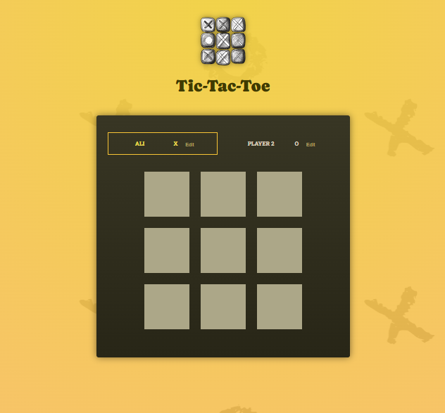

  

 
- The game is develop in react js. 
- The game is totally develop in frontend without using any backend and database. 

  

  ![Ali Imran]
 ![react badge]

<!-- MARKDOWN LINKS & IMAGES -->
[Ali Imran]:https://img.shields.io/badge/ali%20imran-inspire%20to%20live-blue
[react badge]:https://shields.io/badge/react-black?logo=react&style=for-the-badge
